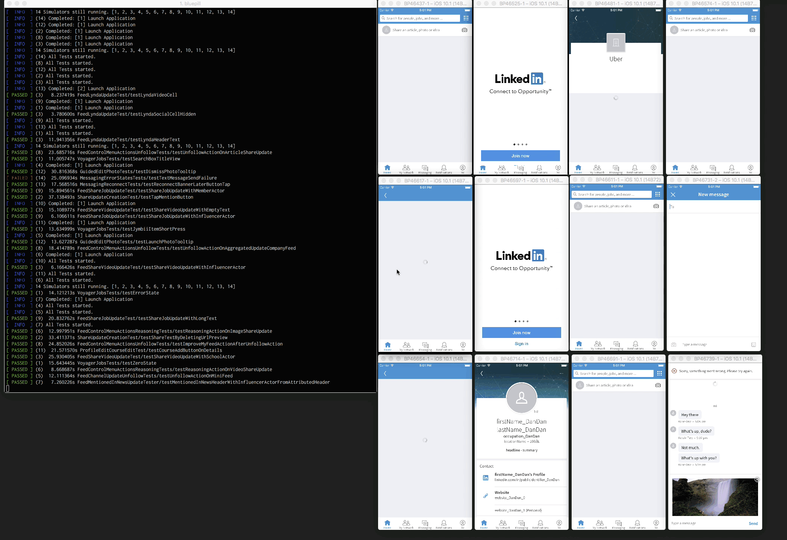

[](https://travis-ci.org/linkedin/bluepill)

Bluepill is a tool to run iOS tests in parallel using multiple simulators.

## Motivation

LinkedIn created Bluepill to run iOS tests in parallel using multiple simulators.

## Features

-  Running tests in parallel by using multiple simulators.
-  Automatically packing tests into groups with similar running time.
-  Running tests in headless mode to reduce memory consumption.
-  Generating a junit report after each test run.
-  Reporting test running stats, including test running speed and environment robustness.
-  Retrying when the Simulator hangs or crashes.

## Usages

It is quick and easy to start using Bluepill!

- Get bluepill binary: build from source or use our [releases](https://github.com/linkedin/bluepill/releases/).
- Build your app and test bundle. Remember to include `build-for-testing` flag if you use `xcodebuild` in terminal.
- Run!

```
./bluepill -a ./Sample.app -s ./SampleAppTestScheme.xcscheme -o ./output/
```

Alternatively, you can use a configuration file like the one below:

```
{
   "app": "./Sample.app", # Relative path or abs path
   "scheme-path": "./SampleAppTestScheme.xcscheme", # Relative path or abs path
   "output-dir": "./build/" # Relative path or abs path
}
```

And run

```
./bluepill -c config.json
```

## Flags

A full list supported options are listed here.


| Config Arguments   | Command Line Arguments | Explanation                                                                        | Required | Default value    |
|:------------------:|:----------------------:|------------------------------------------------------------------------------------|:--------:|:----------------:|
|        `app`       |           -a           | The path to the host application to execute (your .app)                            |     Y    | n/a              |
|    `output-dir`    |           -o           | Directory where to put output log files (bluepill only)                            |     Y    | n/a              |
|    `scheme-path`   |           -s           | The scheme to run tests                                                            |     Y    | n/a              |
|       config       |           -c           | Read options from the specified configuration file instead of the command line     |     N    | n/a              |
|       device       |           -d           | On which device to run the app.                                                    |     N    | iPhone 6         |
|       exclude      |           -x           | Exclude a testcase in the set of tests to run  (takes priority over `include`).    |     N    | empty            |
|      headless      |           -H           | Run in headless mode (no GUI).                                                     |     N    | off              |
|      xcode-path    |           -X           | Path to xcode.                                                                     |     N    | xcode-select -p  |
|       include      |           -i           | Include a testcase in the set of tests to run (unless specified in `exclude`).     |     N    | all tests        |
|     json-output    |           -J           | Print test timing information in JSON format.                                      |     N    | off              |
|    junit-output    |           -j           | Print results in JUnit format.                                                     |     N    | true             |
|     list-tests     |           -l           | Only list tests in bundle                                                          |     N    | false            |
|      num-sims      |           -n           | Number of simulators to run in parallel. (bluepill only)                           |     N    | 4                |
|    plain-output    |           -p           | Print results in plain text.                                                       |     N    | true             |
|    printf-config   |           -P           | Print a configuration file suitable for passing back using the `-c` option.        |     N    | n/a              |
|    error-retries   |           -R           | Number of times we'll recover from app crashing/hanging and continue running       |     N    | 5                |
|  failure-tolerance |           -f           | The number of retries on any failures (app crash/test failure)                     |     N    | 0                |
|  only-retry-failed |           -F           | When `failure-tolerance` > 0, only retry tests that failed                         |     N    | false            |
|       runtime      |           -r           | What runtime to use.                                                               |     N    | 10.2             |
|    stuck-timeout   |           -S           | Timeout in seconds for a test that seems stuck (no output).                        |     N    | 300s             |
|    test-timeout    |           -T           | Timeout in seconds for a test that is producing output.                            |     N    | 300s             |
|        test        |           -t           | The path to the test bundle to execute (single .xctest).                           |     N    | n/a              |
| additional-xctests |           n/a          | Additional XCTest bundles that is not Plugin folder                                |     N    | n/a              |
|    repeat-count    |           -C           | Number of times we'll run the entire test suite (used for load testing).           |     N    | 1                |
|      no-split      |           -N           | Test bundles you don't want to be packed into different groups to run in parallel. |     N    | n/a              |
|       quiet        |           -q           | Turn off all output except fatal errors.                                           |     N    | YES              |
|        help        |           -h           | Help.                                                                              |     N    | n/a              |

## Demo



## Requirements

Latest Xcode (Xcode 8.2.1).

## Q & A
- Are we able to run Xcode UI Testing bundle with Bluepill

  Unfortunately, we don't support Xcode UI Testing bundles yet and we are working on that [**help wanted**].
iOS Unit Testing Bundle is the one we support, which includes [KIF](https://github.com/kif-framework/KIF) tests, [EarlGrey](https://github.com/google/EarlGrey) tests.

- Easies way to get Bluepill binary?

  Latest [release](https://github.com/linkedin/bluepill/releases/).

- How to test Bluepill in Xcode

  Selet BPSampleApp scheme and build it first. Then you can switch back to `bluepill` or `bluepill-cli` scheme to run their tests.

- How to get Bluepill binary from source?

  Run `./bluepill.sh build` to test and build Bluepill. The binary will be output in the ./build folder.

- How to test my changes to Bluepill?

  Run `./scripts/bluepill.sh test`.

